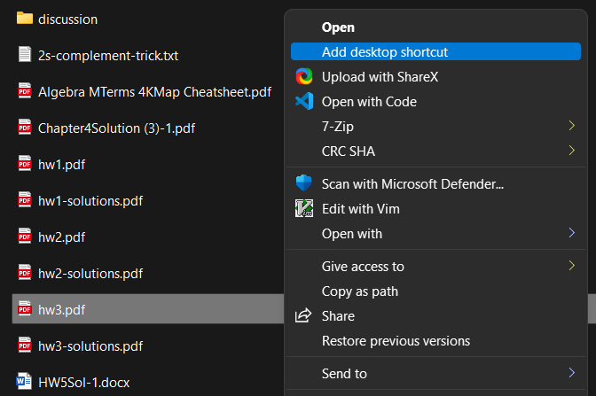
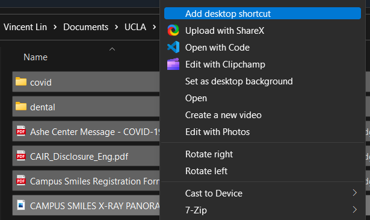

# Desktop Shortcut


## Description

**Generate a shortcut to any file or directory on your Desktop in one step from the context menu.**

### But Why?

The Windows context menu by default has the "Create shortcut" option, but this generates it in the current directory, which you then have to move to your desktop yourself.

Not to mention, it also gives it an annoying " - Shortcut" suffix in the name. This may be what some people want, but I personally find it redundant since the little arrow in the corner of the file icon already shows it's a shortcut, so I don't need the extra long file name.

You could try running something like this, like I did one time:
```powershell
ls *.lnk | % { Rename-Item $_ ($_.Name -replace " - Shortcut", "") }
```
which *works*, but completely resets the position of every icon (they all moved to the top-left corner).

So this simple script seeks to get shortcuts right *the first time*. :sunglasses:

## Installation

1. Download [shortcut.ps1](shortcut.ps1).
2. Place it wherever you want, but preferably somewhere it won't move much, or you'll have to repeat Step 3 when it does.
3. Run the script with the `-Register` switch:
   
   ```powershell
   path\to\format.ps1 -Register
   ```
   The script should now be ready for use from the context menu:

<p align="center">
   
</p>

It can be used with multiple files selected and works with directories too:

<p align="center">
   
</p>

## Limitations

Running the script from the context menu causes a window to briefly pop up, even with the `-WindowStyle Hidden` option to `powershell.exe`. This is especially obvious when performing this action on multiple files at once. This [seems to be a limitation](https://stackoverflow.com/questions/1802127/how-to-run-a-powershell-script-without-displaying-a-window) when running scripts in this manner.
