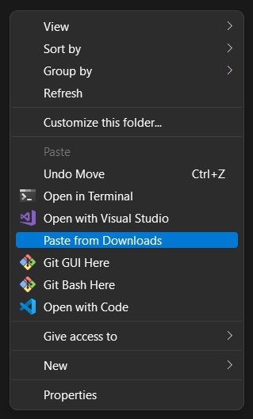

# Downloads Paster


## Description

On Windows, right clicking the empty space in File Explorer brings up a context menu. You can select "Show more options" to bring up another menu like this:



This menu is customizable. With the script [contextmenu.ps1](contextmenu.ps1), you can paste recent items from your Downloads folder to the current directory without having to navigate to the Downloads folder to select, Ctrl+X, navigate back, ...

This was motivated by common use cases in my day-to-day-life:

- Downloading from Discord always puts files in the Downloads folder.
- Downloading from a browser puts files in the Downloads folder by default.
- Downloading things on-the-fly without thinking of where I'll put them yet.
 
## Usage

:information_source: This script requires you to have PowerShell installed. PowerShell comes with most modern Windows computers by default.

1. Download [contextmenu.ps1](contextmenu.ps1).
2. Place this script wherever you want but someplace it won't move much, or you'll have to update Step 8 when its location changes.
3. Open the Windows Registry Editor. You can do this by hitting ⊞+R and searching `regedit`.
4. Navigate to the path:
    ```
    Computer\HKEY_CURRENT_USER\Software\Classes\Directory\Background\shell\
    ```
    You can also copy-paste this into the top bar to be instantly directed there.
5. Within `shell`, make a new key and name it `Downloads`.
6. Double click the created key and set the **Value data** to be whatever you want to show up on the context menu, like "Paste from Downloads."
7. Within `Downloads`, make a new key and name it `command`.
8. Double click the created key and set the **Value data** to:
   ```
   powershell.exe -File path\to\where\you\put\contextmenu.ps1 -WindowStyle Hidden
   ```
   :warning: If powershell.exe is not in your `Path` environment variable, either use the full path to the executable or [add it to your Path](https://stackoverflow.com/questions/29778121/powershell-is-not-recognized-as-an-internal-or-external-command-operable-progr). You know PowerShell is in your `Path` if it runs when you enter the plain `powershell.exe` into CMD.

The script should now be available as an option in your context menu.

## Notes

Running the script from the context menu causes a window to briefly pop up, even with the `-WindowStyle Hidden` option to `powershell.exe`. This [seems to be a limitation](https://stackoverflow.com/questions/1802127/how-to-run-a-powershell-script-without-displaying-a-window) when running scripts in this manner.

[downloads.ps1](downloads.ps1) is a more versatile command-line version of contextmenu.ps1. You can convert it to a PowerShell module and install it to use it anywhere you have your terminal open, though I have not tried this nor tested it myself yet.

Syntax:
```powershell
downloads.ps1 [[-Seconds] <int>] [[-Minutes] <int>] [[-Hours] <int>] [[-Days] <int>] [-Default]
```
The time arguments exactly match those of the built-in cmdlet [New-TimeSpan](https://docs.microsoft.com/en-us/powershell/module/microsoft.powershell.utility/new-timespan?view=powershell-7.2), and they customize how far back in time the script should look for files in the Downloads folder. This script also lists the files it is about to move and prompts for confirmation before proceeding.