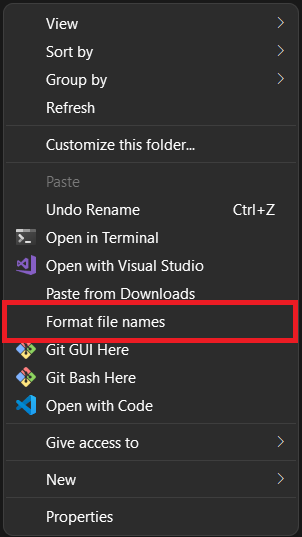

# Format Spaces


## Description

This simple PowerShell script attempts to standardize the word separation format of the file names in the current directory. It does this by converting all instances of whitespace and contiguous underscores (`_`) to hyphen (`-`) characters.

Examples:

| Before                      | After                      |
| --------------------------- | -------------------------- |
| `this_is_an_image.png`      | `this-is-an-image.png`     |
| `nothing-wrong-here.txt`    | `nothing-wrong-here.txt`   |
| `Resume 08-11-22.pdf`       | `Resume-08-11-22.pdf`      |
| `a_Mix for-some  reason.py` | `a-Mix-for-some-reason.py` |

## Installation

1. Download [format.ps1](format.ps1).
2. Place it wherever you want, but preferably somewhere it won't move much, or you'll have to repeat Step 3 when it does.
3. Run the script with the `-Register` switch:
   
   ```powershell
   path\to\format.ps1 -Register
   ```
   The script should now be ready for use from the context menu:

<p align="center">
   
</p>

**OPTIONAL:** If you also want to be able to run this functionality from the command line, you can paste the function definition of `Format-FileNames` into your [PowerShell profile](https://docs.microsoft.com/en-us/powershell/module/microsoft.powershell.core/about/about_profiles?view=powershell-7.2):

```powershell
# Open your profile script in your configured editor
Start-Process $profile
# vim $profile
# code $profile
# etc.
```

Microsoft.PowerShell_profile.ps1
```powershell
function Format-FileNames {
    <# Function pasted from format.ps1 #>
}
# Optional alias
Set-Alias -Name "your-shortcut" -Value Format-FileNames
```

## Limitations

The implementation is quite naive at the moment. Notably, it can mess up file names whose underscores have special meaning, such as `__init__.py`.

In the future, I might attempt a feature that tries to standardize dates as well.

Also, running the script from the context menu causes a window to briefly pop up, even with the `-WindowStyle Hidden` option to `powershell.exe`. This [seems to be a limitation](https://stackoverflow.com/questions/1802127/how-to-run-a-powershell-script-without-displaying-a-window) when running scripts in this manner.
